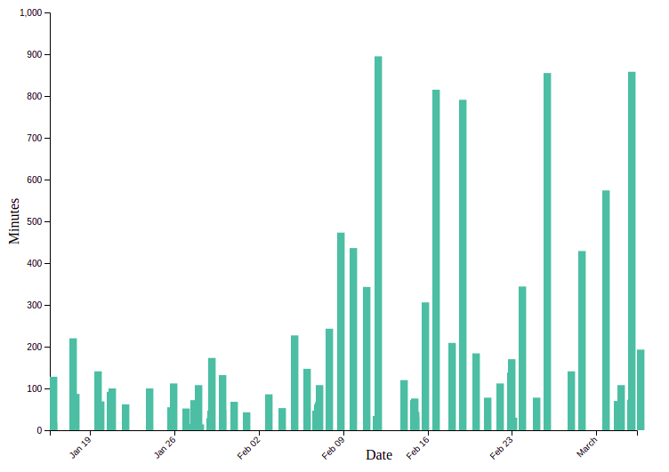

Assignment 4 - DataVis Remix + Multiple Views
===

Link to viz: https://phonymacoroni.github.io/04-Remix/

Remixing the time tracking visualization we explored and discussed in class, I decided to use my own time tracking data from CS 3733 Software Engineering to display what the workload was throughout the term.

This viz helps explore how much the workload increases as the term progresses. 

Technical Achievements
---

There was a great deal of data processing and interpretation that went in to the viz, most notably working with the data exported straight from my time tracking tool of choice, Toggl. 

All of the data processing was done such that a raw file from the software can be fed in, and all processing occurs after the fact. 

A tooltip is shown when you hover over a bar, displaying the start time and duration of the entry.

The timeScale d3 element was very very troublesome and proved difficult to work with. Given more time I think that it would have been conquored, but the I may have been too ambitious with the viz in the type of data I wanted to display.

A brush tool was attempted, using the timeScale d3 element, but this function was not able to be completed and will remain sad in a branch until I am able to return and finish it.

Screenshot
---

Resources
---

- http://bl.ocks.org/cdagli/3f6b27139323e59e0b445de1a04615c3
- https://bl.ocks.org/vikkya/75bda04cd0c00e49cbda6cfee8d97aba
- https://woodyhayday.com/time-visualised/example-three.html
- https://www.d3-graph-gallery.com/graph/barplot_basic.html
- http://bl.ocks.org/anonymous/a05e15339f7792f175d2bcebccf6bbed/7f23db481f1308eb0d5a1834f7cbc0b17d948167